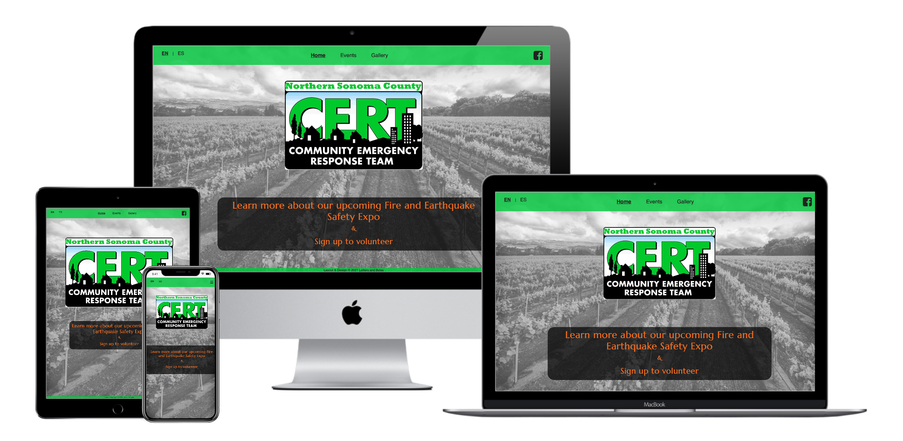

# Northern Sonoma CERT

<div align="center">
    
</div>
<br>

[View deployed site here](https://katjacodes.github.io/northern-sonoma-CERT/)

## Project Description
The online presence for Northern Sonoma County CERT, a community emergency preparedness program located in northern Sonoma County in northern California, United States, was created by Katja Schatte to help Northern Sonoma CERT. The current purpose of the website is to provide information about the upcoming Fire and Earthquake Safety Expo and allow both English- and Spanish-speaking community members to sign up as volunteer for the expo.

Community Emergency Response Teams (CERT) are based on the National CERT Program, run by FEMA, the United States' Federal Emergency Management Agency. The local programs are administered by a local goverment agency, such as a police or fire department. The agency trains community members in basic disaster response skills, customized to the most prevalent emergencies in the respectie region. In California, these emergencies include earthquakes and wildfires. In the event of a major disaster, the trained volunteer emergency workers are equipped to support local first responders.

At the moment, the Northern Sonoma CERT is looking specifically for a website to allow community members to access the flyer, sign up for its upcoming Fire and Earthquake Safety Expo, and share photos after the expo. The program's primary mode of interaction and communication with the community is currently its Facebook page. A link to it features promintently on every page as part of the navigation bar. However, in the future, the purpose of the website will shift to a more general representation of the program and include a general description of the program's purpose and announcements of various upcoming events.

Currently, the general goals of the website are:
* Provide information about the upcoming Fire and Earthquake Safety Expo
* Allow community members to sign up for specific activties offered as part of the expo
* A photo gallery where the site admins can upload pictures from the expo after the event (currently contains test images)
* Provide all information and functionalities in both English and Spanish to make the website more widely accessible to the local community. (The website creator is an English<>Spanish translator, interpreter, and copy writer.)


## UX

### Core Target Audience
#### The core target audience of this organization is:
* Residents in northern Sonoma County
* Local community members of all ages
* English- and Spanish-speaking individuals
* Community members who have heard about the Northern Sonoma County CERT program and visit the website to learn about upcoming activities
* Community members who alredy know about the Fire and Earthquake Safety Expo and want to sign up to volunteer
* Members of CERT programs in other parts of the country who are interested in learning more about the activities of this program

#### Visitors to this website are searching for:
* More information about the upcoming the Fire and Earthquake Safety Expo
* A way to register as volunteers for the Fire and Earthquake Safety Expo
* After the event: Share and look at photos

#### Client Stories
1. As a new visitor to the website, I want to be able to easily accesss information in either English or Spanish, depending on my preferred language.
2. As a new visitor to the website, I want to have easy access to more information about the upcoming Fire and Earthquake Safety Expo and potentially sign up to volunteer.
3. As someone already familiar with the Fire and Earthquake Safety Expo and interested in volunteering, I want to know what volunteer roles are available and sign up.
4. As a local beat reporter, I want to have acess to basic information regarding the Fire and Earthquake Safety Expo, including date, time, and where to find additional information.

### Wireframe Mockups: 
- [Landing Page](assets/images/wireframes/#nosococertLandingPage.png)
- [Events](assets/images/wireframes/nosococertEvents.png)
- [Gallery](assets/images/wireframes/nosococertGallery.png)


## Features
#### Across Pages
Each page features a responsive **navigation bar** with a **language selection menu** (top left) and an easily recognizable **Facebook icon** linking to the program's Facebook page (top right).
Each page has a **footer** with **copyright information**. 

Every page features a background of a typical Sonoma County landscape (vineyards). The background image is cropped to make the content recognizable and aesthetically appealing across devices and screen orientations. 

#### Home
The landing page features the offical CERT logo as the **hero image**. The percentage of the screen the hero image covers increases for screens 768px and above in potrait mode and decreases for screens 768px and above in landscape mode to make the page visually appealing and the content below the hero image easy to locate. Below the hero image, visitors can find direct links to **the event flyer** in pdf format and the volunteer sign-up form. Depending on the language in which the visitor is accesing the landing page, they will be directed to the flyer and the sign-up form in either English or Spanish. In the future, the links to the current event-related information will be replaced with more general information about the program and updated links to event information. Due to the evolving business needs of the client, the homepage is designed in a way that its content can easily be updated and adapted. 

#### Events
Currently, the events pages features **information about volunteer roles** at the upcoming Fire and Earthquake Safety Expo and **sign-up form** that transmits the information directly to a Google spreadsheet using the _API Spreadsheets_ API. The form is optimized to usable on mobile screens and adapts to tablet and computer screens (768px and above).

#### Gallery
The gallery page currently features sample images demonstrating what the gallyery layout will look like once the event pictures get added to it. The standard setting of the **image grid** is one image per row. Above that, the grid features two images per row on screens 768px and above and three images per row on screens 1400px and above. The purpose of this structure is to allow users to clearly see the details of the images at first glance. In addition, the image gallery provides a **JavaScript-supported modal** that enlarge an image to full-screen size on click. After looking at the image, the visitor can return to the gallery by clicking ont the "x" in the upper right corner. Additionally, as soon as the menu bar is no longer visible on the screen, a **scroll-to-the-top button** appears in the lower right corner of the screen. On clicking it, the visitor is taken directly back to the top of the gallery.

### Existing Features
- Language Selection Menu - Exists on [every page](index.html) and allows all users to selct their preferred language on any page. Clicking a language option sends the user to the current page in the selected language and displays the navigatio bar in the selected language.
- Header Navigation Bar - Exists on [every page](index.html) and allows all users to easily navigate all the website's pages and find what they are looking for quickly, including the CERT program's **social media presence on Facebook**.
- Footer Copyright Info - Exists on [every page](index.html) and protects business copyright.
- [Landing Page in English](index.html) and [Landing Page in Spanish](index_es.html) - Allows interested community members to see right away whose page they have landed on and where to find information about the upcoming expo.
- [Events Page in English](events.html) and [Events Page in Spanish](events_es.html) - Provides information about the different volunteer roles available during the Fire and Earthquake Safety Expo at a glance followed by a **sign-up form**.
- [Gallery Page in English](gllery.html) and [Gallery Page in Spanish](gallery_es.html) - Will display images from the expo after the event with the **option for visitors to enlarge them on cklick**.

### Features to Implement in the Future
- Contact form. - Client is currently using his personal email address and will set up business email address to liink the form to in the future.
- Event evaluation form. - Content will be provided by the client after the expo.
- Program description and overview. - Still being developed.


## Technologies Used
- This project uses HTML, CSS, and JavaScript programming languages.
- [Gitpod](https://gitpod.io) 
    - This project uses **Gitpod** for their IDE.
- [BootstrapCDN](https://www.bootstrapcdn.com/)
    - This project uses **Bootstrap4** to simplify the structure of the website and make the website responsive
    - This project also uses BootstrapCDN to provide icons from [FontAwesome](https://www.bootstrapcdn.com/fontawesome/)
- [Google Fonts](https://fonts.google.com/)
    - This project uses **Google fonts** to style the website fonts.
- [jQuery](https://jquery.com/)
    - This project uses **jQuery** to reference Javascript needed for the responsive navbar and sign-up form submission functionality.
- [Popper.js](https://popper.js.org/)
    - This project uses **Popper.js** to reference Javascript needed for the responsive navbar.
- [API Spreadsheets](https://www.apispreadsheets.com)
    - This project uses **API Spreadsheets** to connect the sign-up form to Google spreadsheets via an API.
- [ColorSpace](https://mycolor.space)
    - This project uses **ColorSpace** to determine font colors that go well together.
- [WAVE](https://wave.webaim.org)
    - This project uses the **Web Accessibilty Evaluation Tool** to make sure the website if accessible to visitors of differing abilities. 
- [WebAIM](https://webaim.org/resources/contrastchecker/)
    - This project uses the **WebAIM contrast checker** to make sure the website is accessible to readers with impaired vision.
- [Google PageSpeed Insights](https://developers.google.com/speed/pagespeed/insights/)
    - This project uses **Google PageSpeed Insights** to optimize loading time.

## Testing 
Testing information can be found in a separate [TESTING.md file](TESTING.md).

## Deployment
This project was developed using the [Gitpod](https://gitpod.io), committed to git, and pushed to GitHub using the Gitpod terminal. 

To deploy this page to GitHub Pages from its [GitHub repository](https://github.com/katjacodes/northern-sonoma-CERT), the following process was completed: 
1. Log into GitHub. 
2. Klick on the account avatar in the top right corner and select "Your repositories" from the dropdown menu.
3. From the list of repositories, select **northern-sonoma-CERT**.
4. From the menu bar at the top of the page, select **Settings**.
5. In the menu bar on the left side of the screen, select the second menu item from the bottom, "Pages."
6. In the **Source** section, select **Master Branch** from the dropdown menu, then click on **Save**.
7. As a result, the page is refreshed and the website deployed. The **website URL** appears in a blue box above the **Source Section**.

At the moment of submitting this Milestone project the Development Branch and Master Branch are identical. 

### How to Run This Project Locally
To clone this project into Gitpod you will need a Github account, and API Spreadsheets account, and a Gmail account. You can [create a Github account here](https://github.com/), [create an API Spreadsheets account here.](https://www.apispreadsheets.com/), and [create a Gmail account here](https://mail.google.com/).

Then follow these steps:
1. Log into [Gitpod](https://gitpod.com) with your gitpod account.
2. Navigate to the [Project GitHub repository](https://github.com/katjacodes/gbrw)
3. Click the green "Gitpod" button in the top right corner of the respository
4. This will trigger a new gitpod workspace to be created based on the code in GitHub. There, you will be able to work locally.

To work on the project code within a local IDE such as VSCode, Sublime Text, etc.:
1. Navigate to the [Project GitHub repository](https://github.com/katjacodes/gbrw)
2. Click the "Code" download button next to the green "Gitpod" button.
3. In the Clone section, select HTTPs and copy the clone URL for the repository. 
4. Open your local terminal.
5. Change the current working directory to the location where you want the cloned directory to be located.
6. Type ```git clone```, and then paste the URL you copied in Step 4.
7. Press Enter for your local clon to be created.

You will need to create a Google spreadsheet and an API Spreadsheets acount to create your own sign-up form. To do so, follow theses steps:
1. Create a Google spreadsheet whose colum titles exactly match the ```name``` attribute of your form ```<input>``` tags. 
2. Create an API Spreadsheets account or log into yours if you already have one.
3. On the dashboard, click on the **Google Sheets** button, sign in with your Gmail account, and select the spreadsheet you created to hold the form data.
4. Copy the API url for the spreadsheet and paste it into line 104 of the [form validation JavaScript file](form-validation.js), as demonstrated below:

```// submit to the server if the form is valid```\
```if(isFormValid) {```\
    &nbsp;&nbsp;&nbsp;&nbsp;``` var vals = $("#signup").serialize();```\
    &nbsp;&nbsp;&nbsp;&nbsp;&nbsp;&nbsp;```$.ajax({```\
        &nbsp;&nbsp;&nbsp;&nbsp;&nbsp;&nbsp;&nbsp;&nbsp;&nbsp;&nbsp;&nbsp;&nbsp;```url: "[INSERT API URL HERE]]",```  
        &nbsp;&nbsp;&nbsp;&nbsp;&nbsp;&nbsp;&nbsp;&nbsp;&nbsp;&nbsp;&nbsp;&nbsp;```method: "POST",```\
        &nbsp;&nbsp;&nbsp;&nbsp;&nbsp;&nbsp;&nbsp;&nbsp;&nbsp;&nbsp;&nbsp;&nbsp;```data: vals,```\
        &nbsp;&nbsp;&nbsp;&nbsp;&nbsp;&nbsp;&nbsp;&nbsp;&nbsp;&nbsp;&nbsp;&nbsp;```success: function(){```\
        &nbsp;&nbsp;&nbsp;&nbsp;&nbsp;&nbsp;&nbsp;&nbsp;&nbsp;&nbsp;&nbsp;&nbsp;&nbsp;&nbsp;&nbsp;&nbsp;&nbsp;&nbsp;```alert("Form data submitted");```\
        &nbsp;&nbsp;&nbsp;&nbsp;&nbsp;&nbsp;&nbsp;&nbsp;&nbsp;&nbsp;&nbsp;&nbsp;```},```\
        &nbsp;&nbsp;&nbsp;&nbsp;&nbsp;&nbsp;&nbsp;&nbsp;&nbsp;&nbsp;&nbsp;&nbsp;```error: function(){```\
        &nbsp;&nbsp;&nbsp;&nbsp;&nbsp;&nbsp;&nbsp;&nbsp;&nbsp;&nbsp;&nbsp;&nbsp;&nbsp;&nbsp;&nbsp;&nbsp;&nbsp;&nbsp;```alert("There was an error");```\
        &nbsp;&nbsp;&nbsp;&nbsp;&nbsp;&nbsp;```}```\
      ```});```


## Credits
### Content
- The event flyers in English and Spanish and the English volunteer role titles and descriptions were provided by Geoff Peters. 

### Code
- HTML and JS code for the burger menu was originally taken from [W3 Schools](https://www.w3schools.com/bootstrap4/tryit.asp?filename=trybs_navbar_collapse) and then edited.
- HTML, CSS, and JS code for the sign-up form was originally taken from [JavaScript TUTORIAL](https://www.javascripttutorial.net/javascript-dom/javascript-form-validation/), [Love Spreadsheets](https://lovespreadsheets.medium.com/save-web-html-form-data-to-google-sheets-47e48f7517e6), and [CODEMAHAL](https://www.codemahal.com/video/checkboxes-and-form-validation/)  and substantially edited to fit project needs
- HTML, CSS, and JS code for the image gallery originally taken from [W3 Schools](http://www-db.deis.unibo.it/courses/TW/DOCS/w3schools/howto/howto_css_modal_images.asp.html) and edited to fit project needs.
- HTML, CSS, and JS code for the scroll-to-top button originally taken from [W3 Schools](https://www.w3schools.com/howto/tryit.asp?filename=tryhow_js_scroll_to_top) and edited slightly to fit project needs.

### Acknowledgements
- I got the opportunity to build a website for a real-world project from Geoff Peters.
- My Code Institute mentor, Sebastian Immel provided helpful feedback regarding the behavior when I got stuck with my sign-up form. Thanks to his guidance, I tried coding the form validation adn submission pieces separately, which eventually solved my issue. (See [TESTING.md file](Testing.md) for details.)
- Dominik Habersack helped me located a bug in my form submission code, which prevented the sign-up form from submitting. (See [TESTING.md file](Testing.md) for details.)