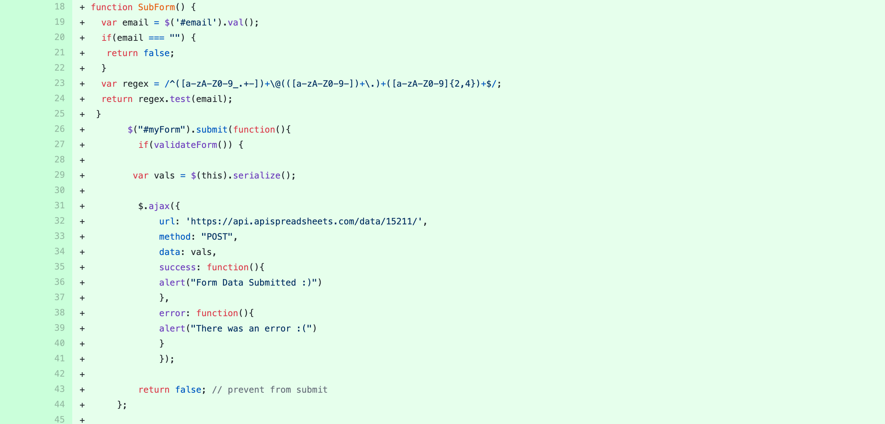

# Northern Sonoma County CERT – Testing details

[Main README.md file](README.md)

[View website on GitHub Pages](https://katjacodes.github.io/northern-sonoma-CERT/)

## Testing

### Automated Testing
#### Validation Services
- [W3C CSS Validation](https://jigsaw.w3.org/css-validator/) was used to validate HTML.
- [W3C Markup Validation](https://validator.w3.org/) was used to validate CSS.
- [JSHint](https://jshint.com/) was used to validate JS.

   - When running JSHint, the error ```unused variable``` appears for the function ```function topFunction()``` on line 18 in the [script.js](script.js). The reason for this error message is that JSHint evaluate the JS code independently from other files. However, this function gets called inline on line 16 of the [gallery.html](gallery.html) and the [gallery_es.html](gallery_es.html) files as part of the scroll-to-top button: ```<button onclick="topFunction()" id="myBtn" title="Go to top">Top</button>```. When evaluating this line of code together with the JS file, the error message disappears.

   - Additionally, the error ```unused variable``` was caused by the jQuery symbol ```$``` on lines 104 and 105 of the [form-validation.js file](form-validation.js). Upon further research on [Stackoverflow](https://stackoverflow.com/questions/8852765/jshint-and-jquery-is-not-defined) and in the [JSHINT documentation](https://jshint.com/docs/options/), I discovered that JSHint does not recognize jQuery unless explicitly prompted. Based on these two sources, I prompted JSHint to do just that by including ```/*globals $:false */``` at the top of the [form-validation.js file](form-validation.js). This solved the issue.

### Client Stories Testing
The path through the website will vary depending on the visitor's interest, existing level of familiarity with the event, and preferred language. Testing the client stories from the UX section provides further insights into the different paths taken by site visitors:

#### Testing Client Stories from the UX Section of README.md
_1. As a new visitor to the website, I want to be able to easily accesss information in either English or Spanish, depending on my preferred language._

   1. A language selection menu located in a conventional location (upper left corner) with abbreviations for English and Spanish in each language (i.e., "EN" for English and "ES" for Español) allows the visitor to easily select their preferred language on any page of the website.

   2. The language selection menu leads the visitor to the current page in the language the select.

   3. In addition, the language selection menu changes the language of the navigation bar across pages.
   

_2. As a new visitor to the website, I want to have easy access to more information about the upcoming Fire and Earthquake Safety Expo and potentially sign up to volunteer._

   1. Information about the upcoming Fire and Earthquake Safety Expo is accessible right from the landing page. Depending on the selected language, the visitor can access the event flyer and the volunteer sign-up form in their preferred language. The event flyer is a donwloadable pdf file that opens in a new tab.

   2. The visitor can also access the volunteer role descriptions and sign-up form by selecting "Events" in the navigation bar.

   3. The Facebook icon is located in the navigation bar in a conventional location (upper right corner), allowing the visitor to easily navigate to more information about CERT and the expo from any page. The Facebook url opens up in a new tab to allow the visitor to return to the CERT page easily.


_3. As someone already familiar with the Fire and Earthquake Safety Expo and interested in volunteering, I want to know what volunteer roles are available and sign up._

   1. Visitors interested in volunteering can access the sign-up form either by clicking on "Events" in the navigation bar or by clicking on the direct link on the landing page.

   2. Short descriptions of the available volunteer roles are provided at the top of the sign-up form in either English or Spanish, depending on the selected language.

   3. The testing form cannot be submitted unless the vistor provided a name, a valid email address, and selected at least one volunteer role.


_4. As a local beat reporter, I want to have acess to basic information regarding the Fire and Earthquake Safety Expo, including date, time, and where to find additional information._

   1. Information about the upcoming Fire and Earthquake Safety Expo is accessible right from the landing page. Depending on the selected language, the visitor can access the event flyer in their preferred language. The event flyer is a donwloadable pdf file that opens in a new tab.
   
   3. The Facebook icon is located in the navigation bar in a conventional location (upper right corner), allowing the visitor to easily navigate to more information about CERT and the expo from any page and reach out to the event organizers with more questions. The Facebook url opens up in a new tab to allow the visitor to return to the CERT page easily.

### Manual (Logical) Testing of All Elements and Functionality on Every Page.

#### Home Page
1. Navigation bar & homepage background image

   1. Go to the "Home" page from a desktop.

   2. Using both Firefox Developer Tools and different devices: Look at the homepage on a desktop screen, a tablet screen, and a phone screen (both in portrait and landscape orientation) to verify that

      - The navigation bar turns into a burger menu when navigating to the homepage on a phone screen.

      - The background image gets resized and cropped in a way that its content remains recognizable and aesthetically pleasing.

   3. Make sure the burger menu pushes down the content when opened. 

   4. Click on each navigation menu item and verify that it links to the correct page.

   5. Click on the Facebook icon and verify that it links to the program's Facebook page.

   6. Click on "ES" in the language selection meanu and verify to it links to the landing page in Spanish and changes the navigation bar into Spanish. Then, click on "EN" and verify that you return to the landing page in English and the English navigation bar.

   7. On both the English and the Spanish landing page, click on the link to the event description and verify that the pdf flyer opens up in a new tab and in the correct language.

   8. On both the English and the Spanish language page, click on the link to the volunteer sign-up form and verify that you are directed to the Events page in the correct language.

   9. Repeat steps 2 through 6 on the Events and the Gallery pages.

#### Events Page
1. Navigation bar and language selector:

   1. Repeat verification steps for the navigation bar and the language selector on the home page.

2. Reduce and expand width of window to verify that the size of the form adjusts to the screen size and continues to look aesthetically pleasing.

3. Using both Firefox Developer Tools and different devices: Look at the Events Page on a desktop screen, a tablet screen, and a phone screen (both in portrait and landscape orientation) to verify the same as in step 2.

4. Sign-up form:

   1. Fill out the submission form by answering all the questions in ways that resemble real answers--i.e. name and email address in conventional formatting, at least one checkbox checked--and verify that 

      - the borders of the name and email address fields turn green.
      - the "Form data was submitted" message appears.

   2. Check the Google spreadsheet to see if the form data was recorded correctly.

   3. Respond to the sign-up questions in ways that should not pass the validation process:

      - Enter a name cotaining special characters.
      - Enter an email address without an ```@```.
      - Do not select any checkboxes.

      and verify that the the borders of the name and email address fields turn red and an error message is displayed below them and that the form cannot be submitted.

   4. Repeat steps 1 through 3 filling out the Spanish sign-up form.

#### Gallery Page
1. Navigation bar and language selector:

   1. Repeat verification steps for the navigation bar and the language selector on the home page.

2. Reduce and expand width of window to verify that the text behaves the way expected: one image per row on screens below 768px, two image per row on screesn below 1400px, and three images per row on larger screens.

3. Using both Firefox Developer Tools and different devices: Look at the Gallery Page on a desktop screen, a tablet screen, and a phone screen (both in portrait and landscape orientation) to verify that the image spacing looks good on all device widths.

4. Hover over the images to verify that the images are sliglty enlarge upon hovering over them.

5. Click on several images to verify that the modal opens, displays the image correctly, and closes upon clicking o the "x" in the upper right corner.

6. Scroll down to verify that the scroll-to-top button appears and click it to verify it works correctly.
      
####  Footer 
1. Using both Firefox Developer Tools and different devices: Look at the About on a desktop screen, a tablet screen, and a phone screen (both in portrait and landscape orientation) to verify that the footer is sticky on all pages and across devices. 

2. Click on the Letters and Bytes link to verify it leads to the developer's website  on all pages.

### Further Testing: 
1. Asked friends, family members, and other Code Institute students to look at the site on their devices and report any issues they find. 

### Bugs Discovered
#### Form data submitted incompletely to the Google spreadsheet
- After working initially, only the email address got recorded in the spreadsheet, but the name information was missing.

- After reviewing my code again various times, I noticed that I had changed the ```name``` attribute on the ```<input>``` tag of the name field wihouth updating the column name in the Google spreadsheet.

- Updating the column name as well solved the issue.

#### Gallery test images appeared in their original sizes
- After adding the test images to the photo gallery I noted that they were giant.

- The solution to the issue was to hard-code the image size in the CSS file. 

-I tried different ways, also taking into account the with/height ratio of different images. Eventually I went with a solution that fit the image into the container and cropped it to show its full width and adjust the height accordingly.

#### Gallery modal not working
- I started out with code found on [W3 Schools](http://www-db.deis.unibo.it/courses/TW/DOCS/w3schools/howto/howto_css_modal_images.asp.html) and gradualle edited it to fit project needs. 

- Since the example code worked only with one image, JavaScript accessed the image to enlarge it using  ```getElementById```.

- Knowing I wanted the modal to work with any image on the gallery page, I changed the code to ```vvar img = document.getElementById('myImg');``` However, the code was still not working.

- After asking on Stackoverfolw, I realized my mistake: Given that I was working with several images, I needed to tell my function to loop through them, hence: 

```for (let i = 0; i < imgs.length; i++) {```\
&nbsp;&nbsp;&nbsp;&nbsp;```imgs[i].onclick = function() {```\
&nbsp;&nbsp;&nbsp;&nbsp;&nbsp;&nbsp;```modal.style.display = "block";```\
&nbsp;&nbsp;&nbsp;&nbsp;&nbsp;&nbsp;```modalImg.src = this.src;```\
&nbsp;&nbsp;&nbsp;&nbsp;```};```\
```}```\

- This solved the issue.

### Form submission no longer working
- After working for a while, form submission all of a sudden stopped working. At the time, my JS code looked like this:

<div align="left">
    
</div>

- Even with the help of Google Developer Tools, I was not able to find the error.

- Durig a meeting with my Code Institute mentor, we discovered a ```204 No Content``` status message in the Newtor section of Google Developer Tools. My mentor explained that this stus indicates that the content has already been submitted and that the best way to avoid this confusion would be to write separete validation and form submission functions. He left it to me how to do that.

### Form submission not working
- The JS code I created to fix the ```204``` issue by drawing on [JavaScript TUTORIAL](https://www.javascripttutorial.net/javascript-dom/javascript-form-validation/) and [Love Spreadsheets](https://lovespreadsheets.medium.com/save-web-html-form-data-to-google-sheets-47e48f7517e6) looked like this:

<figure align="left">
    
    <figcaption>JavaScript code snippet of the transition from the validation to the submission function and error message</figcaption>
</figure>

- At this point, I had tested both the code for form validation and the code for form submission separately, and both were working separately. This led me to conclude that the issue was the transitino between the two parts.

- The error messages I was receiving at that point where the one iin Gitpod (see bottom of the image above) and an error message on JSHint stating that the following variable was not used:

 ```let isFormValid = isFullnameValid &&```\
&nbsp;&nbsp;&nbsp;&nbsp;&nbsp;&nbsp;```isEmailValid;```

despite it being used in the function to submit the form content. 

- I finally reached out to another developer I know via Twitter and learned that both 
```form.addEventListener('submit', function (e) {```\
&nbsp;&nbsp;&nbsp;&nbsp;&nbsp;&nbsp;```e.preventDefault();```

and 

```$("button").click(function()```

serve as event listeners. 

- Once I got rid of the latter line, the code worked:

<figure align="left">
    
    <figcaption>JavaScript code snippet of the transition from the validation to the submission function</figcaption>
</figure>


